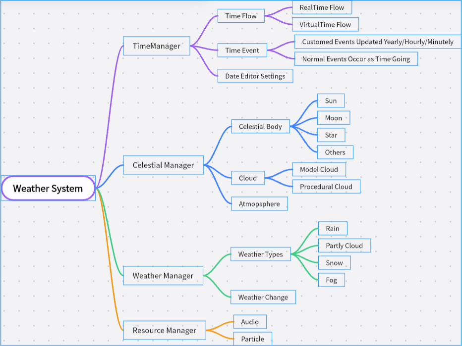

# Wendy WeatherSystem

**A weather system based on Unity URP，This is only for learning.**

## Flow Diagram(流程图)

## Contents

* Basic Weather Effects
* Weather Change&Fade
* Atmosphere Scattering, Ref from UE4
* Basic Editor

## Usage

## Credits

* Unistorm 
* Azure[Sky] Dynamic Skybox
* [MarcusXie3D/MobileWeatherSystem: High performance weather system for mobile platforms, containing fog / rain / snow / thunder & lightning / time of the day. (github.com)](https://github.com/MarcusXie3D/MobileWeatherSystem)

